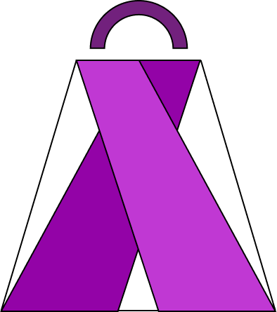

# MadShop UI (Golovin)



## Описание проекта

Это проект макет-дизайн мобильного приложения интернет-магазина на Flutter. 

## Установка и запуск

Чтобы запустить этот проект локально, выполните следующие шаги:

1.  **Клонируйте репозиторий:**
    ```bash
    git clone https://github.com/sopirm/madshop_ui_golovin.git
    cd madshop_ui_golovin
    ```

2.  **Получите зависимости Flutter:**
    ```bash
    flutter pub get
    ```

3.  **Запустите приложение:**
    ```bash
    flutter run
    ```

## Структура проекта

Проект организован по следующей структуре:

```
lib/
├── main.dart             # Точка входа в приложение
├── models/               # Модели данных (Product, CartItem)
├── screens/              # Экраны приложения (Home, Login, Registration, Catalog, Cart, Splash)
├── services/             # Сервисы (CartService для управления корзиной)
├── theme/                # Тема приложения (Colors, TextStyles)
└── widgets/              # Переиспользуемые виджеты (ProductCard)
```

## Экраны приложения

*   **`SplashScreen`**: Экран загрузки при запуске приложения.
*   **`HomeScreen`**: Главный экран с опциями входа и регистрации.
*   **`LoginScreen`**: Экран для входа пользователя.
*   **`RegistrationScreen`**: Экран для регистрации нового пользователя.
*   **`CatalogScreen`**: Экран каталога товаров.
*   **`CartScreen`**: Экран корзины покупок.

